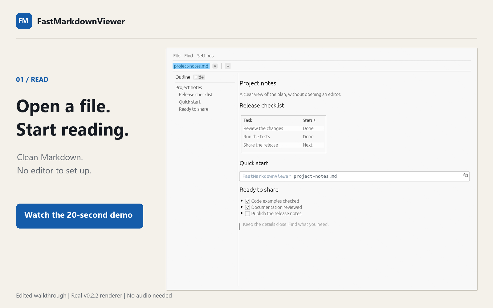
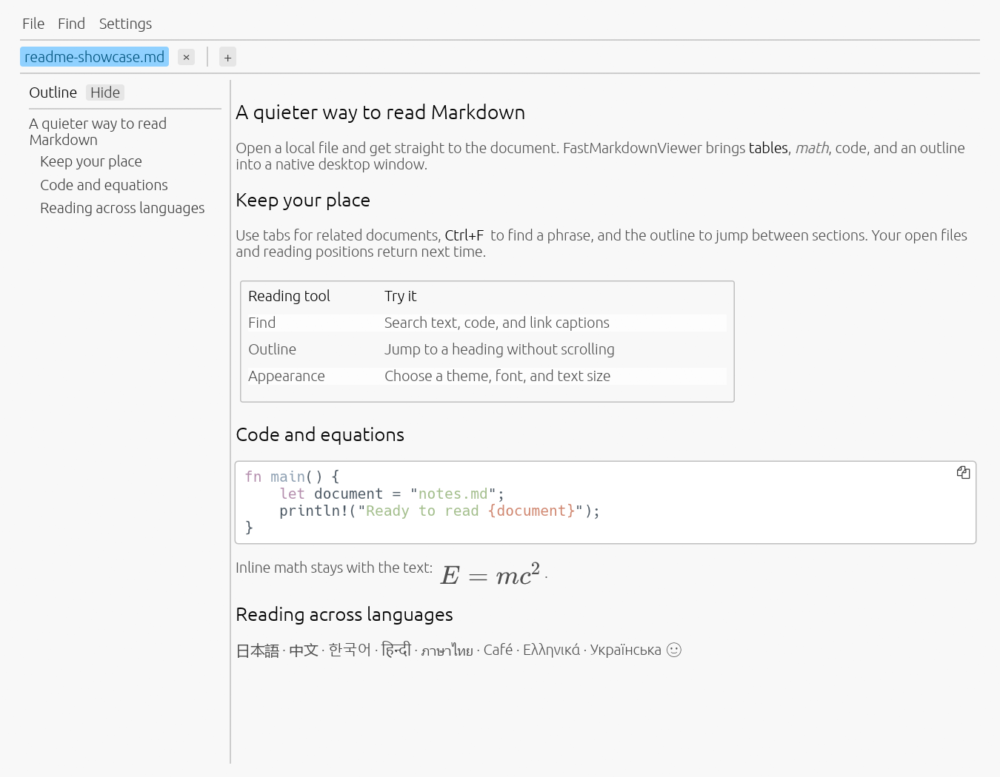
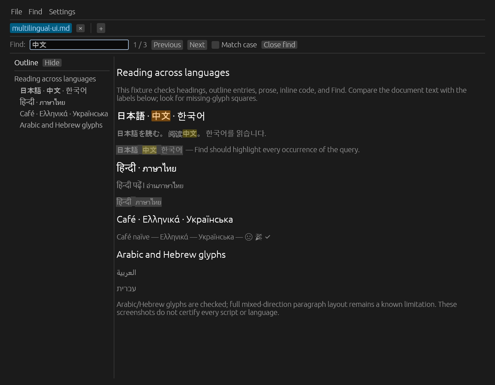
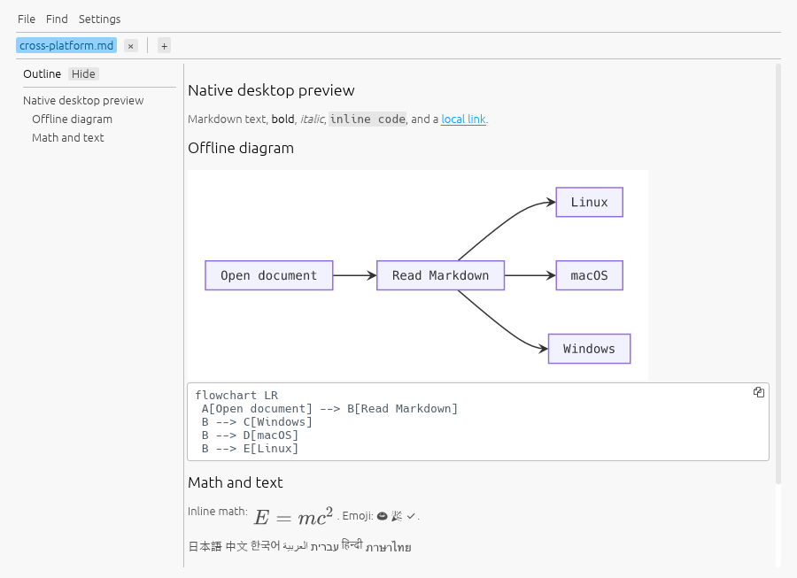
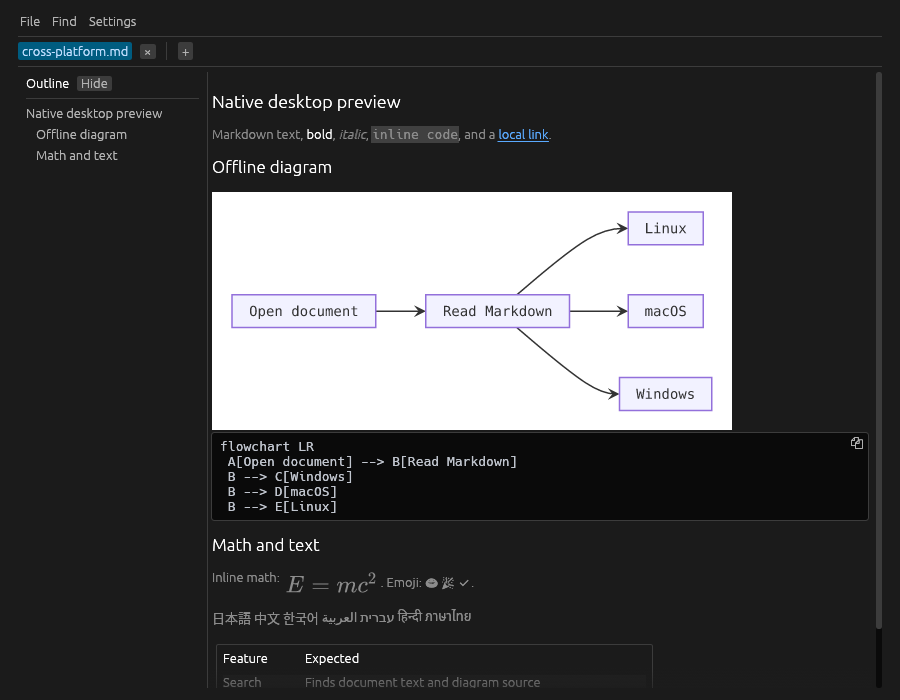

# FastMarkdownViewer

FastMarkdownViewer is a native, read-only Markdown viewer for Windows, macOS, and Linux. Its job is deliberately narrow: double-click a Markdown file and see a rendered document quickly.

See [desktop installation instructions](docs/CROSS_PLATFORM.md) for Windows x64,
macOS 15 or later (Apple Silicon and Intel), and Ubuntu 24.04 x64 packages,
platform requirements, and tested configurations.

> **v0.2.6:** Install official prebuilt binaries with `cargo binstall fast-markdown-viewer`, without compiling or upgrading Rust. Windows retains its automatic Direct3D/CPU graphics fallback. Competitor performance comparisons below retain their measured v0.2.1 baseline.

## Package managers and enterprise deployment

**WinGet:** Publication is pending Microsoft's validation, review, and indexing. Track [package submissions](https://github.com/microsoft/winget-pkgs/pulls?q=is%3Apr+Quetzalcohuatl.FastMarkdownViewer).

**Binstall (prebuilt):** Install [cargo-binstall](https://github.com/cargo-bins/cargo-binstall#installation) once using its precompiled installer, then run:

```sh
cargo binstall fast-markdown-viewer
FastMarkdownViewer document.md
```

Downloads our official release binary for Windows x64, Linux x64, or macOS Apple Silicon/Intel. No Rust compiler upgrade is required. [OS requirements and desktop integration](docs/REGISTRY_DISTRIBUTION.md#binstall-prebuilt-installation) still apply.

**Cargo (build from source):** Install the latest version from [crates.io](https://crates.io/crates/fast-markdown-viewer). Install Rust 1.95+ and the [native build dependencies](docs/REGISTRY_DISTRIBUTION.md#cargo-installation), then run:

```sh
cargo install fast-markdown-viewer --locked
FastMarkdownViewer document.md
```

The [registry distribution guide](docs/REGISTRY_DISTRIBUTION.md) covers installation commands, general internal Cargo mirrors, and mirroring ready-to-run release packages for employee desktops. Existing [release downloads](https://github.com/Quetzalcohuatl/fastmarkdownviewer/releases/latest) are available now.

## See it in 20 seconds

[](https://quetzalcohuatl.github.io/fastmarkdownviewer/#demo)

**Open a file. Find what matters. Read the details.**
An edited walkthrough of the real v0.2.2 renderer, with large captions and no audio required.
[Watch](https://quetzalcohuatl.github.io/fastmarkdownviewer/#demo) · [Download MP4](https://quetzalcohuatl.github.io/fastmarkdownviewer/demo/fastmarkdownviewer-20s.mp4) · [Read the transcript](docs/demo/README.md#transcript)

## Screenshots

The production renderer on Windows 11: light theme, outline, tables, syntax
highlighting, equations, and multilingual text.



<details>
<summary>Dark theme and multilingual Find</summary>



</details>

<details>
<summary>macOS and Ubuntu</summary>

Native platform builds displaying the same Markdown and offline Mermaid diagram.

| macOS 15, Apple Silicon | Ubuntu 24.04, X11 |
| :---: | :---: |
|  |  |

[Screenshot sources and reproduction](docs/screenshots/README.md).

</details>

## Performance: measured against other viewers

In this Windows 11 test, **FMV used 70% less resident process memory than
Markpad, 69% less than Moji, 71% less than Obsidian, and 93% less than
VS Code's Markdown preview** on the ~5 KiB document. It pairs low measured
memory use with tables, math, code highlighting, tabs, and a heading outline.

We searched Google's first three pages for **fast lightweight markdown viewer**,
then expanded the comparison. [Every search result and its disposition](experiments/competitors/google-discovery.md)
is recorded, including products we could not measure. The table below includes
all ten competitors with an established document-reading setup in this Windows
cohort; editors also provide capabilities beyond FMV's read-only scope.

| App/version | ~5 KiB: memory MiB | ~100 KiB: memory MiB | ~5 KiB: CPU ms/s | ~100 KiB: CPU ms/s |
| :--- | ---: | ---: | ---: | ---: |
| **FastMarkdownViewer 0.2.1** | 132.3 | 138.7 | 0.0 | 0.0 |
| aydiler/md-viewer 0.2.0 | 232.0 | 256.3 | 0.0 | 0.0 |
| MarkMello 0.4.0 | 135.0 | 285.6 | 0.0 | 0.0 |
| Markpad 2.7.6 | 438.6 | 615.7 | 107.9 | 123.2 |
| MarkText 0.19.1 | 471.1 | 628.2 | 0.0 | 0.0 |
| MD Preview 1.4.1 | 401.8 | 540.5 | 0.0 | 92.8 |
| mdview-zig 0.2.0 | 42.3 | 43.4 | 0.0 | 0.0 |
| Moji 1.0.7 | 432.0 | 606.6 | 30.9 | 46.4 |
| Obsidian 1.13.7 | 458.1 | 800.1 | 0.0 | 0.0 |
| Typora 1.14.10 | 594.7 | 679.4 | 15.4 | 0.0 |
| VS Code 1.130.0, Markdown preview | 1972.6 | 2271.8 | 694.5 | 1295.0 |

Measured September 14, 2026 on a Ryzen 9 9950X Windows 11 desktop. Medians of
**five fresh launches per app/document**, randomized together; process-tree
memory and CPU sampled about four seconds after window creation. WebView2 and
Electron descendants are included. **1000 ms CPU/s = one occupied core; 0.0 is
below sampling resolution.** This is a startup resource checkpoint, not settled
idle CPU, battery life, peak memory, or completed-render timing.

MarkLite 1.1.1 was also sampled, but its pilot did not establish rendered content;
its ten window-only samples are retained outside the ranking. No failed or
unverified setup is counted as an FMV win. [All 120 raw attempts, ranges, private memory,
window proxies, download sizes, hashes, and reproduction](experiments/competitors/google-results.md).

### Where FMV does—and does not—win

- **Memory:** lower median resident memory than nine of the ten ranked
  competitors on both inputs. **mdview-zig uses less memory than FMV**, while
  leaving tables, tasks, math, and alerts as source in our rendering check.
- **CPU:** FMV measured below resolution in every sample; several competitors
  tie it. These short checkpoints do not establish an energy-efficiency winner.
- **Download:** the Windows portable FMV is **18.2 MiB**, with no browser runtime
  required. Markpad's executable is smaller at **13.4 MiB** and uses WebView2
  separately. Moji's extracted application files occupy **447.5 MiB**; these
  file-byte counts are not a complete installed-footprint comparison.
- **Speed:** some competitors have lower median window-detection times on an
  input. This proxy does not measure when a reader can see the content, so we
  do not claim the fastest rendering or rank Mac/Linux apps using Windows data.

### Features compared

**Yes** = supported/documented, **Partial** = narrower support, **?** = not
established. Unknown does not mean absent. These are product capabilities,
not proof that every dialect/version passes the same rendering tests.

| App | Math | Mermaid | Edit contents | Export / print | External file reload |
| :--- | :---: | :---: | :---: | :---: | :--- |
| **FastMarkdownViewer** | Yes | Partial: native subset | No | No | Manual |
| Markpad | Yes | Yes | Yes | Yes | Automatic |
| Moji | Yes | Yes | Yes | Yes | ? |
| MarkLite | ? | ? | Yes | ? | ? |
| aydiler/md-viewer | Yes | Yes: native renderer | No | ? | Automatic |
| MarkText | Partial in our fixture | Yes | Yes | Yes | ? |
| Typora | Yes | Yes | Yes | Yes | ? |
| Marky (Mac/Linux) | Documented; earlier fixture differed | Yes | No | ? | Automatic |
| Simple Markdown Viewer (Windows Store) | Yes | Yes | Yes | Yes | Automatic |
| MacMD Viewer (Mac) | ? | Yes | No | Yes | Automatic |

FMV offers saved sessions, rendered-text Find, an outline, detachable tabs,
themes and font choices in a focused native reader. Competitors offer capabilities
it lacks: **automatic reload, export, folder browsing, translated UI labels,
Finder Quick Look, and broader Mermaid support**. Multilingual font coverage
does not mean translated menus or complete bidirectional text layout.
[Full sourced feature comparison](experiments/competitors/google-features.md)
also covers iA Writer, MD-Viewer, Markoff, Nimbalyst, both Store viewers,
browser extensions, web editors, mobile alternatives, and the other measured apps.

## What is included

- CommonMark and GitHub-style tables, task lists, strikethrough, autolinks, footnotes, definition lists, and alerts
- Inline, display, and fenced math rendered with RaTeX
- Selectable code blocks with lazy, background syntect highlighting
- Bundled monochrome emoji and system font fallbacks for Japanese, Chinese, Korean, Arabic, Hebrew, Hindi/Devanagari, and Thai on the tested desktop baselines
- Local and remote PNG, JPEG, WebP, first-frame GIF, and SVG images
- Ctrl+F search with highlights, match counts, next/previous navigation, and optional case matching
- A resizable outline sidebar with a Settings toggle
- Multiple document tabs, per-tab scroll/search state, Ctrl+O, and multi-file drag-and-drop
- Drag tabs outside a window to move them into independent native windows
- File/Settings menus, session-wide themes, Ctrl+mouse-wheel zoom, and keyboard scrolling
- A portable executable and a per-user installer for Windows 10 22H2 and Windows 11 x64; Mac app bundles and Ubuntu packages

There is no editor, file watcher, search index, history database, updater, or telemetry.

### Appearance

Settings → Color theme offers System, Light, Dark, Solarized Light, Solarized Dark, Quiet Light, Monokai, and Tomorrow Night Blue. These are lightweight built-in interpretations of familiar editor palettes, not imported VS Code themes or extension support. Code highlighting follows the chosen palette, including changes between two light or two dark themes.

Settings → Text font changes proportional text (including menus and headings); Code font independently changes code and inline code. Choices include familiar Windows families, Helvetica and Menlo on macOS, and DejaVu, Liberation, and Noto families on Linux, when installed. Only available choices appear. Default restores the bundled family. Fonts load on selection, retain emoji/script fallbacks, and are never downloaded or redistributed. This is a curated font list, not an arbitrary installed-font browser; custom font files and editor ligature settings are not supported. Theme, font, and zoom changes apply to all windows in the current process and are saved on normal exit.

## Usage

```text
FastMarkdownViewer.exe
FastMarkdownViewer.exe "C:\path with spaces\README.md"
FastMarkdownViewer.exe --version
```

The installer registers `.md` and `.markdown` under **Open with**. It does not and cannot silently replace your chosen Windows default application.

### Reading shortcuts

| Shortcut | Action |
|:--|:--|
| Ctrl+O | Open a file in a tab; an already-open file activates its tab |
| F5 / Ctrl+R | Reload the current file, keeping the tab and reading position |
| Ctrl+W / middle-click tab | Close a tab |
| Ctrl+Tab / Ctrl+Shift+Tab | Next / previous tab |
| Ctrl+F | Show and focus Find / hide Find |
| Enter / Shift+Enter, F3 / Shift+F3 | Next / previous match (wraps around) |
| Escape | Close Find, or dismiss an error |
| Ctrl+H (also Ctrl+Shift+O) | Show / hide the outline sidebar |

Search operates on rendered text, including code and link captions, and can span inline formatting. `*` matches zero or more characters on the same line (for example, `hello*world`); `\*` finds a literal asterisk. Other punctuation is literal. Wildcards match as much of the line as possible. Image contents and rendered math are not searchable. The outline supports ATX and Setext headings, including duplicate titles. A failed open leaves existing tabs intact. The empty-window page lists reading shortcuts.

Drag a tab onto another tab to reorder it, or outside the window to move it into a new native window, keeping its document, scroll position, search, and caches. Escape cancels a drag. The tab's right-click menu also offers **Move to new window**. Closing the original window keeps detached windows alive; closing the last window exits. Theme and text size are shared within a process; each window has its own outline toggle. Moving tabs into an existing window is not supported yet. Separate command-line launches still start separate processes. On macOS, Finder opens files in the running app and activates an existing tab when possible. Local Markdown links open or activate a tab in the current window.

Reload reads the file again and refreshes its image and rendering caches. If the file has become unreadable, the current document stays open with an error message.

Markdown links such as `[Chapter](docs/chapter.md)` open in this window and reuse an already-open canonical path. `[Section](#section)` scrolls within the current document; `[Section](other.md#section)` opens or activates the target tab and scrolls there. Heading slugs lowercase Unicode text, replace whitespace with hyphens, and remove punctuation other than hyphens/underscores. Repeated headings use `-1`, `-2`, etc.; explicit `{#id}` heading IDs also work. Percent-encoded paths/fragments are supported. Missing files or headings show a nonfatal error. This is practical slug support, not exact GitHub parity.

Right-click a tab for **Rename file…** or **Show in Explorer**. Rename changes the actual filename in its current folder; omitting the extension preserves `.md`/`.markdown`, and other extensions, invalid names, and collisions are rejected. Tab order, active selection, and reading/search state are retained; internal path, title, and resource base are reloaded. It does not rewrite links in other documents. To prevent overwriting even a concurrently created destination, rename uses exclusive hard-link creation followed by removing the original name; this requires a filesystem with hard-link support (such as NTFS). Unsupported filesystems fail with an error, leaving the original in place. A process interruption between those operations can leave both names. Case-only renames on case-insensitive filesystems are rejected as collisions.

**Show in Explorer** opens the parent folder and selects the file. A portable platform abstraction also provides Finder selection on macOS and parent-folder opening elsewhere; The supported desktop baselines are listed in docs/CROSS_PLATFORM.md. Reading never edits document contents; filename changes happen only through the explicit rename action.

Mermaid support renders supported Mermaid fences using patched Rusty, with the source retained underneath. Rendering runs offline in a separate process with a 10-second timeout; unsupported or oversized diagrams show an error and their source. This is not full Mermaid.js compatibility. See [the Rusty fixes](docs/RUSTY_FIXES.md) for details.

**Settings → Automatically load remote images** defaults to on. Turn it off to hide remote images and show individual **Load image** buttons. This setting applies to every window in the current session and is remembered between launches. Requests already running may finish. Ordinary links still open only when clicked.

The current eframe backend does not initialize native accessibility for dynamically created child windows. For screen-reader access, open the file through a separate application launch instead of detaching its tab.

Syntax definitions initialize on a worker only when a language-tagged code block becomes visible. Results are cached by content, language, theme, and font size. Unknown languages remain plain text; blocks over 256 KiB skip highlighting. Highlight caches are bounded to 128 entries and approximately 8 MiB per tab.

East Asian, Indic, and Thai/Lao system fonts load on demand. Glyph coverage depends on installed fonts; no system fonts are redistributed or downloaded. Regression tests cover multilingual filenames, headings, code, Find/rename input, and font changes on the tested Windows, macOS, and Ubuntu baselines. The renderer already uses HarfRust shaping, but full Unicode bidirectional paragraph layout remains limited, so mixed Arabic/Hebrew and left-to-right text needs further renderer work. Coverage is not a guarantee of correct layout for every language. Myanmar, Khmer, Tibetan, Ethiopic, and historic scripts have no dedicated fallback configured and remain unverified. Emoji are monochrome.

Ordinary prose, including long unbroken words, wraps within a reading column capped at 960 logical pixels. Tables give longer columns more room, wrap text and long tokens, and scroll horizontally when their minimum widths exceed the available space. **Settings → Word wrap** is enabled by default for prose, table cells, and code, and is shared across windows in the current session. Disable it to retain long lines and scroll horizontally. Code blocks retain their own horizontal scroll area when needed. Scrollbars stay visible while content overflows and reserve space beside it. The document also has a horizontal scrollbar as a fallback for objects that cannot fit. Nested blockquotes and inline styles preserve their surrounding structure and formatting.

Definition lists are an extension, not part of core CommonMark. Write a term on one line followed by `: Definition` on the next; multiple definitions and indented continuation paragraphs are supported. Failed images display an **Image unavailable** placeholder with alt text, error details on hover, and a **Retry** button.

## Build from source

Use Rust 1.95.0. Windows additionally needs the Visual Studio 2022 C++ Build Tools
with a Windows 10/11 SDK; see [the desktop guide](docs/CROSS_PLATFORM.md) for
macOS and Ubuntu prerequisites and build commands.

```powershell
rustup show
cargo build --locked --release --target x86_64-pc-windows-msvc
```

Release artifacts are built by GitHub Actions from annotated `vX.Y.Z` tags. See [CONTRIBUTING.md](CONTRIBUTING.md) for local checks, [docs/TESTING.md](docs/TESTING.md) for the permanent interaction gates, [docs/BENCHMARKING.md](docs/BENCHMARKING.md) for the performance protocol, and [docs/RELEASE-CHECKLIST.md](docs/RELEASE-CHECKLIST.md) for release decisions and validation evidence.

## Privacy and security

Local Markdown is rendered without a browser engine; raw HTML is inert text. Remote images referenced by a document load asynchronously when enabled, with scheme, redirect, response-size, and decoded-size limits. Image workers and memory caches are bounded and start only when needed. No cookies, credentials, referrer, persistent cache, analytics, or update request is used. Details are in [PRIVACY.md](PRIVACY.md) and security reports belong under [SECURITY.md](SECURITY.md).

## License

Licensed under either [Apache License 2.0](LICENSE-APACHE) or [MIT](LICENSE-MIT), at your option.

## Saved settings and sessions

On normal exit, the viewer saves appearance preferences (theme, text/code fonts,
zoom, and word wrap), the automatic remote-image preference, and the open file
paths, tab order, active tab, outline visibility, and vertical reading positions.
Unavailable fonts fall back to the bundled default.

Starting without a file restores the saved session. Opening a specific file uses
saved preferences but starts with that file alone. Inactive restored tabs load
from disk only when selected; they do not preload document contents or images.
A missing or unreadable file stays as a tab with an error and a retry button.
Reading positions are approximate if the document or layout has changed.

**File → Quit application** saves all open windows together and exits. Closing
individual windows removes them from the session; closing the last window saves
its tabs. Explicitly closed tabs stay closed. Restored windows use the default
size and OS placement, avoiding stale positions on disconnected monitors.

State is a small local `FastMarkdownViewer/state.json` file under `%APPDATA%`
on Windows, `~/Library/Application Support` on macOS, and `$XDG_CONFIG_HOME`
(or `~/.config`) on Linux. This also applies to the portable executable. Delete
that file while the app is closed to reset preferences and forget the session.
Document contents, image caches, and search queries are not saved. There is no
periodic saving or polling; forced termination can lose changes since the last
normal exit. Independent processes share the file: the last process to exit wins.
Restoration is limited to 32 windows and 256 tabs per window, with a 1 MiB state-file
limit. Invalid or unsupported state files fall back to default settings.
