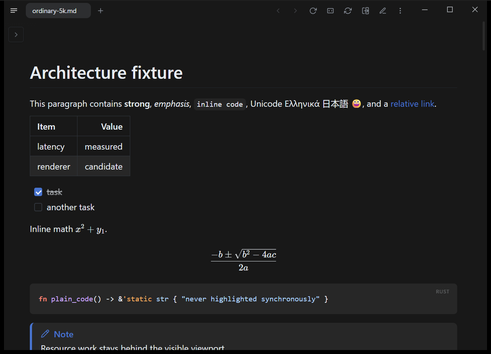
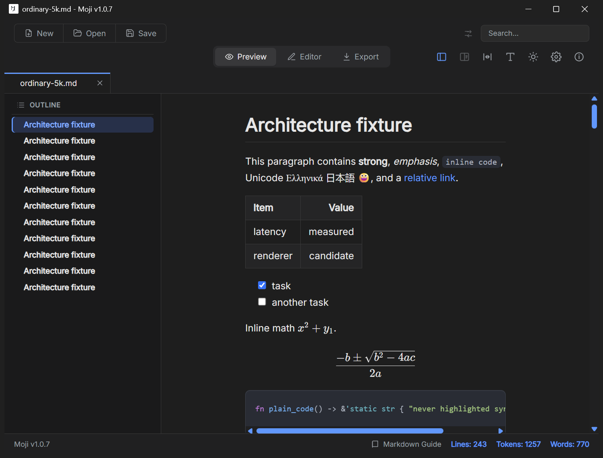

# Expanded cohort: setup and rendering observations

Observed September 14, 2026 on the Windows benchmark machine. Resource
measurements and visual spot checks are separate. A visible window alone does
not certify correct rendering. The synthetic small fixture was supplied on the
command line; no private document was opened for these checks.

## Markpad 2.7.6

The portable binary opened `ordinary-5k.md` in reading mode. The visible section
showed a formatted table, checked/unchecked tasks, inline and display math,
highlighted Rust, a styled note alert, Greek and Japanese text, and a color emoji.
The document tab and navigation/zoom/edit controls were present. This establishes
a usable initial reading view, not complete Markdown conformance or scrolling
performance. Its WebView2 process tree was included in the resource samples.

## Moji 1.0.7

The unmodified extracted release opened the same file in **Preview** mode, with
a document tab and outline. The visible section showed a table, checked/unchecked
tasks, inline/display math, highlighted Rust, Greek/Japanese text and a color
emoji. Editing and export were available as controls; their full functionality
was not exercised by this spot check. The source contains the same repeat
structure as all the other samples.

These captures are of the actual released competitors, not FMV mockups or
vendor marketing screenshots. They were captured outside the measured batch.
Screenshots are evidence of the initial visible section, not render-completion
timestamps. Default window sizes and layouts differ between applications.

## MarkLite 1.1.1 — not ranked

The official installer was unpacked with innounp 2.71.1, including Flutter,
plugins and assets. The native title contained the supplied document path, but
the content area remained white. Both a window capture and a foreground desktop
capture showed the blank area. A follow-up allowed 30 seconds with the ordinary
environment instead of redirected profile variables and still showed a blank
document area. The log identified Flutter's Impeller OpenGLES backend but did
not establish the cause.

The 120-attempt CSV includes ten MarkLite windows/resource samples. They are
**not a validated document-reading result** and are not counted as FMV wins.
We did not modify the competitor, disable GPU rendering, or silently replace
its release with a source build to obtain a favorable result. A normal installed
setup may behave differently; the observation does not establish universal
failure or lack of Markdown features.

## Setups not admitted to the measured cohort

- **Nimbalyst 0.77.5:** launch reached a welcome/setup modal asking for an app mode.
  A usable document-reading state was not established. No agent was configured.
- **Markdown Viewer Free 1.1.0.0:** acquired from Microsoft Store. Launching its
  executable directly with the path created a window, but the capture did not
  establish document content. Store activation and a validated adapter remain
  necessary. No reading-performance score is assigned.
- **Simple Markdown Viewer / iA Writer / Mac apps / browser/mobile products:**
  see the individual [acquisition and platform limits](google-discovery.md#acquisition-and-coverage-limits).

## Existing competitors

The other eight competitor binaries match the executable hashes in the
[September 13 study](maintenance-results.md). Their earlier
[rendering observations](observations.md) remain the source of the spot-check
coverage labels; their resource measurements were rerun in this batch.
The FMV binary is the published 0.2.1 release. Its fuller product/regression
coverage is documented in [the main README](../../README.md) and
[desktop validation](../../docs/CROSS_PLATFORM.md).
