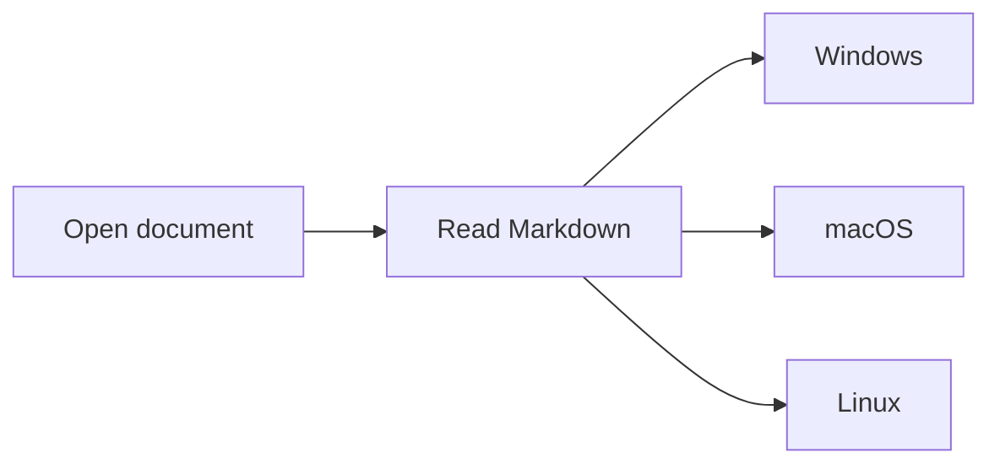

# Native desktop preview

Markdown text, **bold**, *italic*, `inline code`, and a [local link](feature-matrix.md).

## Offline diagram

## Math and text

Inline math: $E = mc^2$. Emoji: 😀 🎉 ✅.

日本語 中文 한국어 العربية עברית हिन्दी ภาษาไทย

| Feature | Expected |
| --- | --- |
| Search | Finds document text and diagram source |
| Fonts | Readable text and local script fallbacks |
