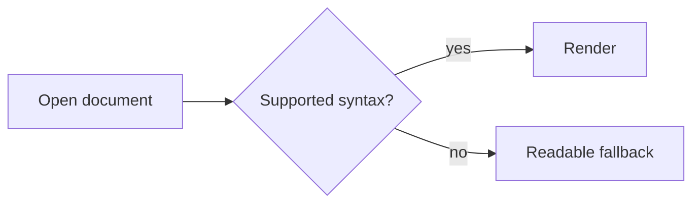
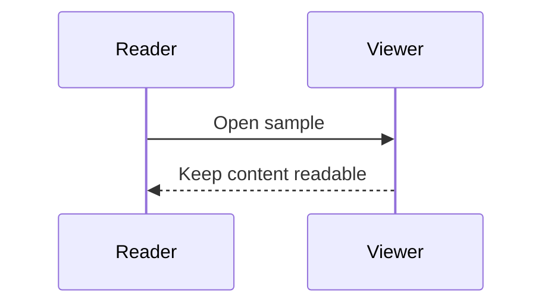
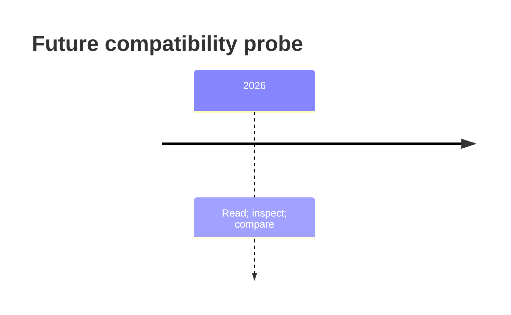
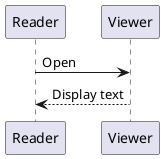
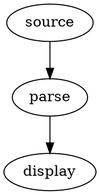

# Torture test 3 — unclaimed features and deliberate limits

Baseline: FastMarkdownViewer v0.1.3, README and PRIVACY at `0b0bd73`. Created 2026-09-09. These are **exploratory probes, not promised functionality or confirmed bugs**. Source histories and caveats: [research](docs/TORTURETEST-RESEARCH.md). Supported regression checks: [torturetest2.md](torturetest2.md).

For every case record: rendered / readable literal fallback / degraded but usable / crash or lost surrounding content. Lack of an unclaimed feature is not a release failure. Crashes, script execution, document mutation, or broken surrounding supported Markdown are still bugs. All payloads below are inert test data, not commands to run. No script payload is needed to test the advertised inert-HTML policy.

This file uses local assets and ordinary links only; reading it should not contact a remote image host. Some features cannot be tested by Markdown syntax: their cases specify manual actions. Keep assets alongside the repository. Each END sentinel should remain readable, except where a documented Markdown fallback naturally groups text differently.

## T3-01 — YAML front matter as metadata

The YAML at the beginning is a probe. No front-matter parser or metadata card is promised. It may appear as text, a rule, or a Setext-style heading under Markdown parsing. It must not make the whole document vanish. Sources: [simov #226](https://github.com/simov/markdown-viewer/issues/226), [grip #243](https://github.com/joeyespo/grip/issues/243), [trsdn #18](https://github.com/trsdn/mdviewer/issues/18).

T3-01-END.

## T3-02 — Mermaid diagrams

Expected current behavior: readable code blocks, not diagrams. Source: [Glow #342](https://github.com/charmbracelet/glow/issues/342), [simov #299](https://github.com/simov/markdown-viewer/issues/299). Mermaid integration is explicitly deferred in this app.







T3-02-END.

## T3-03 — PlantUML and Graphviz

Expected current behavior: plain code; no process launch, network diagram service, or generated image. Source: [simov #249](https://github.com/simov/markdown-viewer/issues/249) and [#292](https://github.com/simov/markdown-viewer/issues/292). Graphviz is an additional unclaimed diagram dialect, not a reported fix in those issues.





T3-03-END.

## T3-04 — Wikilinks, aliases, and embedded notes

No Obsidian link resolution or transclusion is promised. Literal fallback is acceptable; headings containing this syntax must not crash the outline. Sources: [Frogmouth #21](https://github.com/Textualize/frogmouth/issues/21), [#88](https://github.com/Textualize/frogmouth/issues/88), [rajatarya v1.6.0](https://github.com/rajatarya/mdviewer/releases/tag/v1.6.0).

[[chapter one]]

[[chapter one#Destination|A friendly title]]

![[chapter one]]

![[quadrants.png|180]]

### Heading with [[a wiki target|an alias]]

T3-04-END.

## T3-05 — Include directives

No include expansion, recursive file loading, or folder documentation engine is promised. Leave the directive readable. Source: [Frogmouth #115](https://github.com/Textualize/frogmouth/issues/115).

[!include[chapter](tests/fixtures/torturetest-assets/chapter%20one.md)]

--8<-- "tests/fixtures/torturetest-assets/chapter one.md"

T3-05-END.

## T3-06 — Rendered HTML and collapsible sections

Expected current behavior: inert HTML source, not browser layout or interactive disclosure. Markdown surrounding it must remain usable. Sources: [Frogmouth #71](https://github.com/Textualize/frogmouth/issues/71), [#81](https://github.com/Textualize/frogmouth/issues/81), [mdcat #292](https://github.com/swsnr/mdcat/issues/292).

<details>
<summary>A disclosure control is not promised</summary>
<p>Content inside an HTML disclosure.</p>
</details>

<table><tr><th colspan="2">Merged heading</th></tr><tr><td>A</td><td>B</td></tr></table>


T3-06-END — raw HTML must not consume unrelated later Markdown.

## T3-07 — CSS, inline styles, and custom themes

No CSS engine or user-defined HTML theme is promised. The following must not resize the document or recolor other sections. Sources: [ekino #23](https://github.com/ekino/MarkdownViewer/issues/23), [simov #285](https://github.com/simov/markdown-viewer/issues/285), [trsdn #4](https://github.com/trsdn/mdviewer/issues/4). This is a harmless style-isolation probe, not a reproduced XSS payload.

<style>.torture-probe { color: purple; font-size: 72px; }</style>

<span class="torture-probe" style="background:lime">Inert style sample</span>

Ordinary **bold Markdown** should still work here.

T3-07-END.

## T3-08 — Non-GFM tables and interactive sorting

The delimiter row below omits column separators and is not a valid two-column GFM table. Literal or ordinary Markdown interpretation is acceptable. Sorting, merged cells, and grid-table parsing are unclaimed. Sources: [simov #235](https://github.com/simov/markdown-viewer/issues/235), [#234](https://github.com/simov/markdown-viewer/issues/234).

| fruit | quantity
--------------------
| pear | 3

+----------+----------+
| grid A   | grid B   |
+==========+==========+
| 1        | 2        |
+----------+----------+

| Sort probe | Count |
|---|---:|
| Zebra | 10 |
| Apple | 2 |

Clicking the last table's header need not sort it; that table itself should render normally.

T3-08-END.

## T3-09 — Highlight, superscript, subscript, and emoji shortcodes

No special rendering is promised for these extensions. Compare actual Unicode emoji with shortcodes without requiring equivalence. Sources: [md-preview #23](https://github.com/vorojar/md-preview/issues/23), [simov #272](https://github.com/simov/markdown-viewer/issues/272), [rajatarya v1.6.0](https://github.com/rajatarya/mdviewer/releases/tag/v1.6.0).

==highlighted words==

H~2~O and x^2^.

:rocket: :smile: :custom_nonexistent_emoji: versus 🚀 😀.

Inline code must stay literal regardless: `==text== :rocket: x^2^`.

T3-09-END.

## T3-10 — Obsidian comments and foldable callouts

Double-percent comments are an Obsidian extension, not core Markdown comments. Hiding them is not promised. Collapsible callout syntax and custom callout types are unclaimed. Sources: [simov #294](https://github.com/simov/markdown-viewer/issues/294), [#171](https://github.com/simov/markdown-viewer/issues/171).

Before %% comment-like text %% after.

%%
Multiline comment-like content.
%%

> [!NOTE]- Foldable title
> This need not collapse.

> [!CUSTOM]
> Unknown alert type should remain readable.

T3-10-END.

## T3-11 — Other math delimiters and full TeX compatibility

Only inline dollar, display dollar, and fenced math are claimed. Parenthesis/bracket delimiters, GitLab math, equation numbering, cross-references, macros, and arbitrary packages are exploratory. Sources: [simov #56](https://github.com/simov/markdown-viewer/issues/56), [#166](https://github.com/simov/markdown-viewer/issues/166), [Glow #862](https://github.com/charmbracelet/glow/issues/862). Basic math belongs in T2-10; not every unsupported command is a regression.

\( a^2+b^2=c^2 \)

\[
\sum_{k=1}^{n} k = n(n+1)/2
\]

$`q_1+q_2`$

$$
\newcommand{\probe}[1]{\mathbf{#1}}
\probe{x} \tag{A} \label{eq:probe}
$$

Reference attempt: $\eqref{eq:probe}$.

T3-11-END — unsupported math must not break the rest of the document.

## T3-12 — Unescaped currency ambiguity

The README does not promise natural-language money detection. Observe what happens; do not require every dollar sign to remain literal. This is a boundary extension of [md-preview #13](https://github.com/vorojar/md-preview/issues/13), not a claim that issue reported currency handling.

The first item costs $6 and the second costs $14 today.

Salary range: $50,000–$70,000.

Control with explicit escapes: the first item costs \$6 and the second costs \$14 today.

T3-12-END.

## T3-13 — Image animation, HTML sizing, and image lightboxes

GIF animation, HTML image sizing, and click-to-zoom inspection are not promised. Current GIF support is first-frame only, so a still red frame is correct. Sources: [trsdn #21](https://github.com/trsdn/mdviewer/issues/21), [mdcat #292](https://github.com/swsnr/mdcat/issues/292).


{width=120 height=60}

Action: click the valid image. A lightbox need not appear. Any app action must leave the document intact.

T3-13-END.

## T3-14 — Full bidirectional layout and unverified scripts

Arabic/Hebrew glyph coverage is claimed; full mixed-direction paragraph ordering is explicitly limited. Other listed scripts have no dedicated fallback. Record legibility and ordering separately. Source inspiration: [simov #275](https://github.com/simov/markdown-viewer/issues/275); the exact scope comes from FastMarkdownViewer's README, not an upstream bidi fix.

English (العربية 123) עברית [ABC-42] end.

עברית: test@example.com — 123.45 — العربية.

Myanmar: မြန်မာစာ

Khmer: ភាសាខ្មែរ

Tibetan: བོད་ཡིག

Ethiopic: አማርኛ

Historic Gothic: 𐌰𐌱𐌲

T3-14-END.

## T3-15 — Print and export layout

Print, PDF, HTML, and image export are unclaimed. There is no pass requirement for pagination, repeating table headers, clickable exported links, or print margins. Sources: [rajatarya v1.8.0](https://github.com/rajatarya/mdviewer/releases/tag/v1.8.0), [v1.8.5](https://github.com/rajatarya/mdviewer/releases/tag/v1.8.5), [grip #302](https://github.com/joeyespo/grip/issues/302).

<div style="page-break-before:always">A page-break request is inert source.</div>

| Export column A | Export column B |
|---|---|
| A hyperlink | [Supported local link](torturetest2.md) |

T3-15-END.

## T3-16 — Watchers, editing, persistent settings, and session restore

Manual capability inventory: externally edit a disposable file without pressing Reload; restart the app after changing settings; reopen the same document. Auto-refresh, in-app editing, autosave, restoring tabs, and remembered progress/settings are not promised. Use T2-25 to test the supported explicit reload behavior. Sources: [md-preview #18](https://github.com/vorojar/md-preview/issues/18), [v1.4.1](https://github.com/vorojar/md-preview/releases/tag/v1.4.1), [trsdn #11](https://github.com/trsdn/mdviewer/issues/11). newuni's recent releases only contained distribution boilerplate, so they supply no specific fix evidence here.

T3-16-END.

## T3-17 — Directory browsing and single-instance tab routing

A directory tree, fuzzy file picker, recent-file database, and sending every command-line launch to an existing process are unclaimed. Separate launches currently create separate processes. Merging detached tabs back into an existing window is explicitly unsupported. Sources: [Frogmouth #121](https://github.com/Textualize/frogmouth/issues/121), [trsdn v2.2.0](https://github.com/trsdn/mdviewer/releases/tag/v2.2.0), [md-preview v1.4.1](https://github.com/vorojar/md-preview/releases/tag/v1.4.1).

Manual probe: open a second instance, inspect folder-navigation capabilities, and attempt to drag a tab onto the other window. Record unsupported behavior without calling it a regression. Existing tabs must not be lost.

T3-17-END.

## T3-18 — Search inside images, math, and across documents

Image pixels and rendered math are explicitly excluded from Find. Workspace search, regular expressions, and a persistent index are unclaimed. Source inspiration: [Frogmouth #16](https://github.com/Textualize/frogmouth/issues/16), [Glow #183](https://github.com/charmbracelet/glow/issues/183); exclusions are from this app's README.


$$
z_{987654321}=1
$$

Action: search for the word painted inside the image, then for the numeric subscript shown in the rendered equation. No match is required for the image or rendered math. Search `.*` must follow the app's literal-dot plus wildcard semantics, not an assumed regex engine. Cross-file results are not required.

T3-18-END.

## T3-19 — Other markup languages

reStructuredText, AsciiDoc, MDX components, and notebook execution are unclaimed. These samples may be plain text or ordinary Markdown; they must not execute anything. Sources: [Frogmouth #72](https://github.com/Textualize/frogmouth/issues/72), [grip #341](https://github.com/joeyespo/grip/issues/341), [md-preview #27](https://github.com/vorojar/md-preview/issues/27). MDX/AsciiDoc are additional exploratory variants.

.. note:: reStructuredText directive

   A directive body.

NOTE: AsciiDoc-style admonition.

<ReaderCard title="MDX component probe" />

```python
# A code fence is not an executable notebook cell.
print("No execution requested")
```

T3-19-END.

## T3-20 — Accessibility in detached child windows

Manual probe with a screen reader: compare a separately launched document window with a detached tab window. The README explicitly documents limited native accessibility in detached child windows. Record what is announced and navigable; do not mistake glyph rendering for accessibility conformance. Source inspiration: [trsdn #22](https://github.com/trsdn/mdviewer/issues/22) (accessible code controls); detached-window limitation is specific to FastMarkdownViewer.

T3-20-END — final sentinel. This file maps future scope; it does not expand the v0.1.3 support contract.
